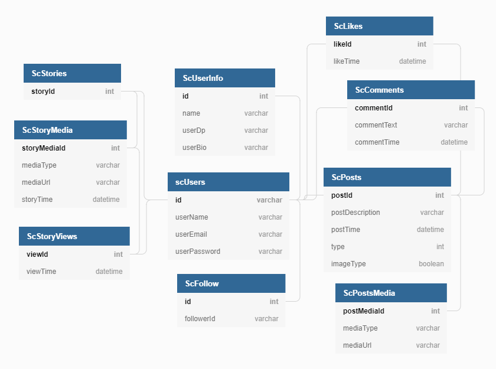

# TheSocialConnect
This app is basically an Instagram clone that is developed using flutter for frontend and nodeJs, typescript, PostgreSQL, TypeORM and other techs and tools for backend.

# Database Schema:

    

## Features

<ul>
  <li>Authentication using JWT</li>
  <li>View Posts</li>
  <li>View Stories like instagram</li>
  <li>Upload images in portrait,landscape and square</li>
  <li>Follow and unfollow users</li>
  <li>Search users</li>
</ul>

And much more...

